<div align="center">

<!-- ══════════════════════════════════════════════════════════ -->
<!--                    PROFILE BANNER                         -->
<!-- ══════════════════════════════════════════════════════════ -->



<br/>

<!-- Social Badges -->
<a href="https://www.linkedin.com/in/theaniketchoudhari">
  
</a>
&nbsp;
<a href="mailto:aniketchaudhari090@gmail.com">
  
</a>
&nbsp;
<a href="https://github.com/theaniketchoudhari">
  
</a>
&nbsp;
<a href="https://www.instagram.com/theaniketchoudhari">
  
</a>
&nbsp;
<a href="https://www.youtube.com/@theaniketchoudhari.">
  
</a>
&nbsp;
<a href="https://leetcode.com/u/aniketchaudhari090">
  
</a>

</div>

<br/>


<!-- ══════════════════════════════════════════════════════════ -->
## 💼 Featured Projects

<table>
<tr>
<td width="50%" valign="top">

### 🛒 E-Commerce Sales & Revenue Analytics
Analyzed **50,000+ transactional records**, identified top 5 SKUs driving **30% of total revenue**. Built interactive Power BI dashboards tracking GMV, margin %, and monthly growth.

**Tech:** `Python` `Pandas` `SQL` `MySQL` `Power BI`

</td>
<td width="50%" valign="top">

### 🧾 Invoice Management System

Full-stack invoicing app with **real-time P&L reporting** and automated payment reminders. Designed the PostgreSQL schema powering all billing calculations.

**Tech:** `React` `Node.js` `PostgreSQL`

</td>
</tr>
<tr>
<td width="50%" valign="top">

### 🎯 Biometric Attendance Terminal
[**🔗 Live Demo →**](https://vip-attendance.vercel.app)

AI facial recognition attendance with **eye-blink liveness detection** to prevent spoofing, plus an admin dashboard with real-time Google Sheets sync.

**Tech:** `Python` `OpenCV` `Google Sheets API`

</td>
<td width="50%" valign="top">

### 📈 More on GitHub
Explore my pinned repos for ML experiments, BI dashboards, and full-stack builds.

[**🔗 View All Repositories →**](https://github.com/theaniketchoudhari?tab=repositories)

</td>
</tr>
</table>


## 🏆 Achievements

<div align="center">


</div>

<!-- ══════════════════════════════════════════════════════════ -->
## 🏢 Experience Timeline

```text
━━━━━━━━━━━━━━━━━━━━━━━━━━━━━━━━━━━━━━━━━━━━━━━━━━━━━━━━
  2026 Jun  ◆  Data Science Engineer Intern
               Greateway Software Pvt. Ltd.
━━━━━━━━━━━━━━━━━━━━━━━━━━━━━━━━━━━━━━━━━━━━━━━━━━━━━━━━
  2026 Apr  ◆  ML & Data Science Intern
               EduSkills Foundation (AICTE)
━━━━━━━━━━━━━━━━━━━━━━━━━━━━━━━━━━━━━━━━━━━━━━━━━━━━━━━━
  2025 Apr  ◆  Cloud Computing Intern
               AWS Academy
━━━━━━━━━━━━━━━━━━━━━━━━━━━━━━━━━━━━━━━━━━━━━━━━━━━━━━━━
  2024 May  ◆  AI/ML Intern
               Google (via EduSkills / AICTE)
━━━━━━━━━━━━━━━━━━━━━━━━━━━━━━━━━━━━━━━━━━━━━━━━━━━━━━━━
  2024 Jan  ◆  AI/ML Intern
               Pantech Solutions
━━━━━━━━━━━━━━━━━━━━━━━━━━━━━━━━━━━━━━━━━━━━━━━━━━━━━━━━
```


<!-- ══════════════════════════════════════════════════════════ -->
## 📊 GitHub Stats

<div align="center">


<br/>


</div>


<!-- ══════════════════════════════════════════════════════════ -->
<div align="center">

### 📫 Let's Build Something Great Together

> I'm actively seeking full-time **Data Scientist / AI-ML Engineer** roles — open to hybrid or remote opportunities.

<a href="https://linkedin.com/in/theaniketchoudhari">
  
</a>
&nbsp;
<a href="mailto:aniketchaudhari090@gmail.com">
  
</a>

<br/><br/>


<br/><br/>

<!-- ══════════════════════════════════════════════════════════ -->
<!-- SNAKE ANIMATION -->
<!-- ══════════════════════════════════════════════════════════ -->
<picture>
  <source media="(prefers-color-scheme: dark)" srcset="https://raw.githubusercontent.com/theaniketchoudhari/theaniketchoudhari/output/github-contribution-grid-snake-dark.svg">
  <source media="(prefers-color-scheme: light)" srcset="https://raw.githubusercontent.com/theaniketchoudhari/theaniketchoudhari/output/github-contribution-grid-snake.svg">
  
</picture>

<br/><br/>


</div>
